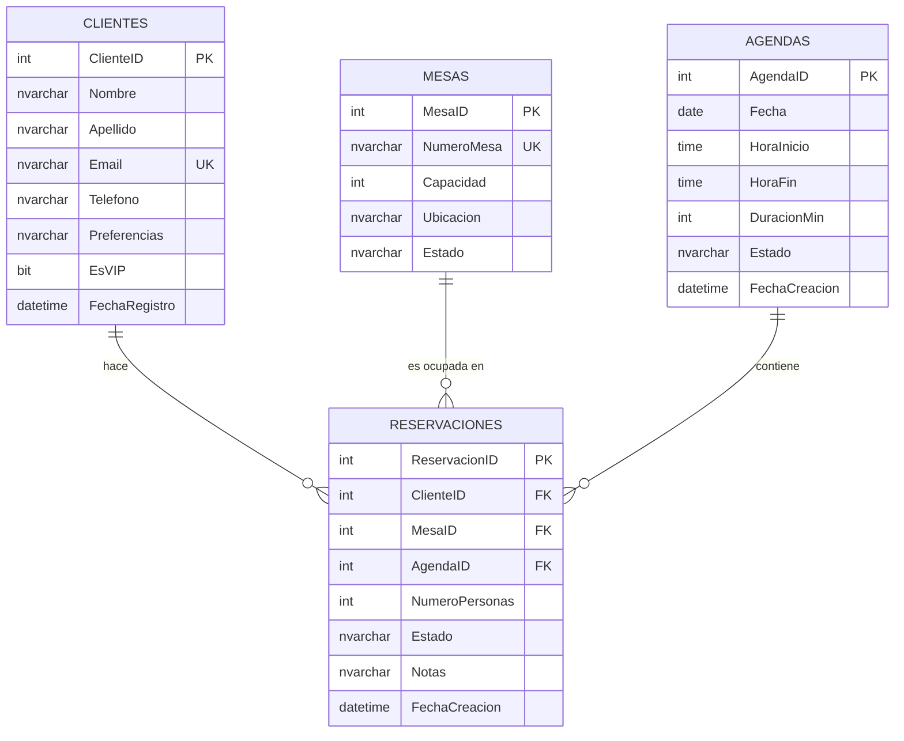

# 🗂️ Diagrama Entidad-Relación (ERD)

Modelo de datos del sistema de reservas **ÉLYSÉE** (v2 — con tabla Agendas).

## Diagrama visual (Mermaid)



## Diagrama ASCII (respaldo)

```
┌──────────────────────┐              ┌──────────────────────┐
│      CLIENTES        │              │        MESAS         │
├──────────────────────┤              ├──────────────────────┤
│ 🔑 ClienteID         │              │ 🔑 MesaID            │
│    Nombre            │              │    NumeroMesa        │
│    Apellido          │              │    Capacidad         │
│    Email (UQ)        │              │    Ubicacion         │
│    Telefono          │              │    Estado            │
│    Preferencias      │              └──────────┬───────────┘
│    EsVIP             │                         │
│    FechaRegistro     │                         │
└──────────┬───────────┘                         │
           │                                     │
           │         ┌───────────────────────┐   │
           │         │    RESERVACIONES      │   │
           │         ├───────────────────────┤   │
           └────────►│ 🔑 ReservacionID      │◄──┘
                     │ 🔗 ClienteID  (FK)    │
                     │ 🔗 MesaID     (FK)    │
                     │ 🔗 AgendaID   (FK)    │
                     │    NumeroPersonas     │
                     │    Estado             │
                     │    Notas              │
                     │    FechaCreacion      │
                     └───────────┬───────────┘
                                 │
                                 │
                     ┌───────────┴───────────┐
                     │       AGENDAS         │
                     ├───────────────────────┤
                     │ 🔑 AgendaID           │
                     │    Fecha              │
                     │    HoraInicio         │
                     │    HoraFin            │
                     │    DuracionMin        │
                     │    Estado             │
                     │    FechaCreacion      │
                     └───────────────────────┘
```

**Leyenda**: 🔑 PK · 🔗 FK · UQ Unique

## Cardinalidad

| Relación | Tipo | Descripción |
|----------|------|-------------|
| Clientes → Reservaciones | 1:N | Un cliente puede tener muchas reservaciones |
| Mesas → Reservaciones | 1:N | Una mesa puede tener muchas reservaciones |
| Agendas → Reservaciones | 1:N | Una agenda puede contener muchas reservaciones |
| Clientes ↔ Mesas ↔ Agendas | N:M:N | Se relacionan a través de Reservaciones |

## Reglas de Negocio

1. Una reservación pertenece a 1 cliente, 1 mesa y 1 agenda.
2. Una mesa puede tener múltiples reservaciones en distintas horas del mismo día, **siempre que sus horarios NO se solapen**.
3. Se permiten dos reservaciones consecutivas en la misma mesa (ej: 15:00-17:00 y 17:00-19:00).
4. La duración de una reservación es elegida por el cliente: **mínimo 30 min, máximo 180 min**.
5. La capacidad máxima del restaurante es de **50 personas** (suma de las 13 mesas).
6. Las agendas se crean automáticamente al hacer la primera reserva.
7. Las agendas se eliminan automáticamente (lazy) si están vencidas y no tienen reservaciones activas.
8. Los estados válidos de una reservación son: `Pendiente`, `Confirmada`, `Cancelada`, `Completada`, `NoShow`.
9. Los estados válidos de una mesa son: `Disponible`, `Ocupada`, `Reservada`, `Mantenimiento`.
10. Los estados válidos de una agenda son: `Abierta`, `Cerrada`.

## Regla de solapamiento (crítica)

Dos reservaciones se solapan si:

```
HoraInicio_A < HoraFin_B  AND  HoraFin_A > HoraInicio_B
```

**Ejemplos**:

| A | B | ¿Solapa? |
|---|---|:--------:|
| 15:00-17:00 | 17:00-19:00 | ❌ No (contacto exacto) |
| 15:00-17:00 | 16:00-18:00 | ✅ Sí |
| 15:00-17:00 | 19:00-21:00 | ❌ No |
| 19:00-21:00 | 19:00-21:00 | ✅ Sí (idénticos) |

La validación se aplica **por mesa**. Dos reservaciones en mesas distintas pueden solaparse sin problema.

## Documentación detallada

- [Clientes](./tablas/01-clientes.md)
- [Mesas](./tablas/02-mesas.md)
- [Reservaciones](./tablas/03-reservaciones.md)
- [Agendas](./tablas/04-agendas.md)