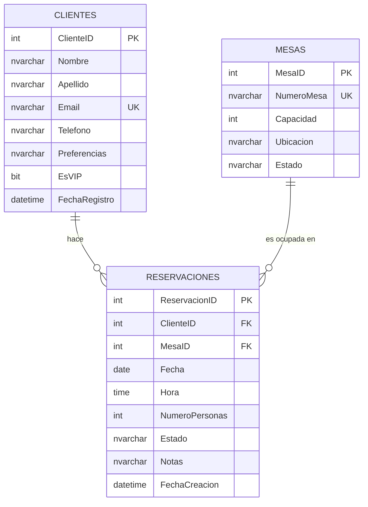

# 🗂️ Diagrama Entidad-Relación (ERD)

Modelo de datos del sistema de reservas **ÉLYSÉE**.

## Diagrama visual (Mermaid)



## Diagrama ASCII (respaldo)

```
┌──────────────────────┐              ┌──────────────────────┐
│      CLIENTES        │              │        MESAS         │
├──────────────────────┤              ├──────────────────────┤
│ 🔑 ClienteID         │              │ 🔑 MesaID            │
│    Nombre            │              │    NumeroMesa        │
│    Apellido          │              │    Capacidad         │
│    Email (UQ)        │              │    Ubicacion         │
│    Telefono          │              │    Estado            │
│    Preferencias      │              └──────────┬───────────┘
│    EsVIP             │                         │
│    FechaRegistro     │                         │
└──────────┬───────────┘                         │
           │                                     │
           │         ┌───────────────────────┐   │
           │         │    RESERVACIONES      │   │
           │         ├───────────────────────┤   │
           └────────►│ 🔑 ReservacionID      │◄──┘
                     │ 🔗 ClienteID  (FK)    │
                     │ 🔗 MesaID     (FK)    │
                     │    Fecha              │
                     │    Hora               │
                     │    NumeroPersonas     │
                     │    Estado             │
                     │    Notas              │
                     │    FechaCreacion      │
                     └───────────────────────┘
```

**Leyenda**: 🔑 PK · 🔗 FK · UQ Unique

## Cardinalidad

| Relación | Tipo | Descripción |
|----------|------|-------------|
| Clientes → Reservaciones | 1:N | Un cliente puede tener muchas reservaciones |
| Mesas → Reservaciones | 1:N | Una mesa puede tener muchas reservaciones en distintas fechas/horas |
| Clientes ↔ Mesas | N:M | Se relacionan a través de Reservaciones |

## Reglas de Negocio

1. Un cliente no puede tener dos reservaciones activas en la misma fecha/hora.
2. Una mesa no puede tener dos reservaciones activas en la misma fecha/hora.
3. No se permiten reservaciones en fechas pasadas.
4. El número de personas no puede exceder la capacidad de la mesa.
5. Los estados válidos de una reservación son:
   - `Pendiente`
   - `Confirmada`
   - `Cancelada`
   - `Completada`
   - `NoShow`
6. Los estados válidos de una mesa son:
   - `Disponible`
   - `Ocupada`
   - `Reservada`
   - `Mantenimiento`
7. Al borrar un cliente, se eliminan en cascada sus reservaciones.
8. No se puede borrar una mesa que tenga reservaciones asociadas.

## Modelo simplificado

- **3 tablas** en lugar de 4 (no hay tabla catálogo de estados).
- Los estados se validan con `CHECK CONSTRAINT` directamente en la tabla.
- La integridad de doble reservación se maneja en la capa de backend con transacciones.

## Documentación detallada

- [Clientes](./tablas/01-clientes.md)
- [Mesas](./tablas/02-mesas.md)
- [Reservaciones](./tablas/03-reservaciones.md)